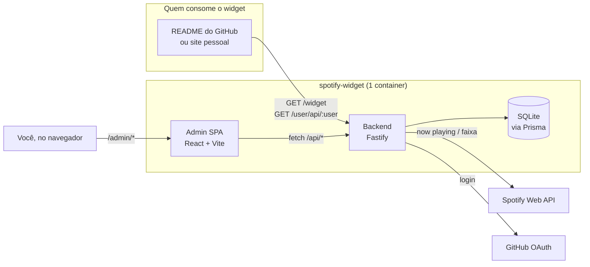

<p align="center">
  
</p>

<p align="center">
  Widget SVG dinâmico da sua música atual (ou favorita) do Spotify. Cola no README do GitHub, no seu site ou em qualquer lugar que aceite <code>&lt;img&gt;</code>.
</p>

<p align="center">
  
  
  
  
</p>

---

## ✨ O que ele faz

| | |
| --- | --- |
| 🎵 **Now Playing** | mostra a música que você está ouvindo, em tempo real |
| 📌 **Track fixa** | ou fixa uma música específica pra exibir sempre |
| 🎨 **Aparência sob demanda** | tema, fundo, cor do texto e escala, tudo via query param, sem precisar salvar |
| 🔒 **Privacidade** | um toggle esconde os dados públicos a qualquer momento |
| 👥 **Multi-usuário** | RBAC completo (admin / user / viewer), pra hospedar pra mais gente |
| 🔐 **Login flexível** | senha, GitHub OAuth ou modo público, dá pra combinar |
| 🐳 **Deploy zero-config** | `docker compose up --build -d` e pronto |

## 🗺️ Como as peças se encaixam



O backend serve duas coisas: a rota pública `/widget` (o SVG) e o painel `/admin` (a SPA de configuração). Cada usuário guarda as próprias credenciais do Spotify no banco. Não existe client ID/secret "global" no `.env`.

## 🚀 Quick Start

**A forma mais rápida:**

```bash
git clone https://github.com/KaduKessler/Spotify-Widget.git
cd Spotify-Widget
docker compose up --build -d
```

Sem `.env`, sem segredo pra gerar na mão. Na primeira execução, o container cria e imprime uma senha de admin sozinho. Detalhes na seção "🐳 Docker" mais abaixo.

<details>
<summary><strong>Ou direto na máquina, sem Docker</strong></summary>

### Requisitos

- Node.js 22+
- pnpm
- Conta Spotify Developer (opcional, só pro modo Now Playing)

### Instalação

```bash
git clone https://github.com/KaduKessler/Spotify-Widget.git
cd Spotify-Widget

pnpm install

cp backend/.env.example backend/.env
# edite backend/.env com suas variáveis (veja "Variáveis de Ambiente" abaixo)

cd backend && pnpm exec prisma migrate dev && cd ..

pnpm dev  # backend (porta 3000) + admin (porta 5173) juntos
```

Acesse `http://127.0.0.1:5173` pro painel em dev, ou `http://127.0.0.1:3000/widget` pra ver o SVG puro.

> Credenciais do Spotify (Client ID/Secret) **não vão no `.env`**. Cada usuário cadastra as suas próprias na aba Configuração do painel, depois de logar.

</details>

## 🎨 Como usar o widget

```markdown

```

```html

```

O jeito mais fácil de montar essa URL é copiar direto do painel (aba Configuração → Embed): ele já monta com a aparência que você escolheu.

<details>
<summary><strong>Query params disponíveis</strong></summary>

| Param | Valores | Efeito |
| --- | --- | --- |
| `user` | username | qual usuário exibir (obrigatório fora do painel) |
| `theme` | `dark` \| `light` | sobrescreve o tema salvo |
| `bg` | hex sem `#`, ou `transparent` | cor de fundo customizada |
| `color` | hex sem `#` | cor do texto customizada |
| `scale` | `0.5` a `3` | escala do widget (1 = tamanho original 495×160) |
| `spin` | `1` \| `true` | anima a capa do álbum girando |
| `rainbow` | `1` \| `true` | equalizer com cores em arco-íris |
| `scan` | `1` \| `true` | mostra o scan code do Spotify (abre a faixa no app) |

```markdown
<!-- tema light -->


<!-- fundo transparente, texto branco, 150% do tamanho -->

```

</details>

## 🎛 Painel administrativo

Três abas, depois de logar em `/admin`:

- **Configuração**: editor único, preview e controles lado a lado. Modo (Now Playing/Track fixa), tema, aparência (fundo/cor/tamanho), toggle de privacidade, embed pronto pra copiar, credenciais do Spotify.
- **Usuários** (admin): lista, cria, edita role e reseta senha de qualquer usuário.
- **Whitelist GitHub** (admin, só com `REGISTRATION_POLICY=github_whitelist`): controla quem pode criar conta via GitHub OAuth, um por um ou em lote.

<details>
<summary><strong>Sistema de autenticação e RBAC (detalhes)</strong></summary>

### Providers (dá pra combinar mais de um)

**Password**

```env
ENABLE_PASSWORD_AUTH=true
ADMIN_USERNAME=seu_usuario
ADMIN_PASSWORD=sua_senha
```

Contas locais com senha hasheada (bcrypt), armazenadas no banco. O admin inicial vem do env como fallback.

**GitHub OAuth**

```env
ENABLE_GITHUB_AUTH=true
GITHUB_CLIENT_ID=...
GITHUB_CLIENT_SECRET=...
```

Cria conta automaticamente no primeiro login, respeitando a política de registro. O callback (`{APP_URL}/auth/github/callback`) é montado a partir de `APP_URL`, não existe variável separada pra ele.

**None (público)**

```env
ENABLE_NONE_AUTH=true
```

Sem autenticação nenhuma. Útil pra uso pessoal ou demo.

### Roles

| Role | Permissões |
| --- | --- |
| `admin` | acesso total: gestão de usuários, config global |
| `user` | edita a própria config do widget e credenciais |
| `viewer` | só visualiza |

### Políticas de registro

```env
REGISTRATION_POLICY=open  # open | github_whitelist | invite_only | closed
```

- `open`: qualquer pessoa cria conta
- `github_whitelist`: só usuários GitHub na whitelist
- `invite_only`: só via convite de admin (futuro)
- `closed`: nenhum registro novo

### Whitelist GitHub

```env
GITHUB_WHITELIST=user1,user2,user3
```

Essa lista do `.env` é importada pro banco automaticamente na primeira execução, e **complementa** (não substitui) a whitelist gerenciada pelo painel. Lá dá pra adicionar em lote, validar contra a API do GitHub, rastrear quem adicionou e remover com auditoria (soft-delete, dá pra reativar depois).

### Outras flags

```env
ADMIN_USERS=admin,johndoe,janedoe   # sempre recebem role admin
ALLOW_PASSWORD_SIGNUP=true          # false = só o admin inicial do env loga
```

</details>

<details>
<summary><strong>API Endpoints (detalhes)</strong></summary>

**Públicos**

- `GET /widget?user=username` - SVG do widget
- `GET /user/api/:username` - JSON com a track atual (respeita a flag de privacidade)
- `GET /health`, `GET /ready` - health/readiness check

**Autenticação**

- `POST /auth/login`, `POST /auth/logout`
- `GET /auth/github`, `GET /auth/github/callback`
- `GET /auth/spotify`, `GET /auth/spotify/callback`, `POST /auth/spotify/disconnect`
- `GET /api/auth-config` - providers e política de registro ativos

**Autenticados**

- `GET /api/me` - usuário logado (com role)
- `GET /api/config`, `POST /api/config` - config do widget
- `GET /api/spotify-config`, `POST /api/spotify-config`, `DELETE /api/spotify-config`
- `GET /api/spotify/status`, `GET /api/spotify/now-playing`

**Admin only**

- `GET /api/admin/users`, `POST /api/admin/users`
- `PUT /api/admin/users/:username/role`, `PUT /api/admin/users/:username/password`

</details>

## 🔒 Privacidade

O toggle **"Expor dados no JSON público"** (modal Flags) controla o endpoint `/user/api/:username`: ligado, retorna os dados da track; desligado, responde `204 No Content` e esconde tudo. Bom pra pausar a exibição sem desconfigurar o widget.

## 🐳 Docker

```bash
docker compose up --build -d
docker compose logs -f app   # ver a senha gerada na 1ª execução
```

```text
================================================================
 Nenhum ADMIN_PASSWORD definido. Senha gerada pra você:

   usuário: owner
   senha:   aMrsZxNJL_3i11RY

 Salva em /app/data/.admin_password. Troque depois de logar.
================================================================
```

Acesse `http://localhost:3000/admin/` com essas credenciais.

<details>
<summary><strong>Fixar suas próprias credenciais</strong></summary>

Crie um `.env` na raiz (mesma pasta do `docker-compose.yml`), o Compose lê automaticamente:

```env
SESSION_SECRET=gere_com_openssl_rand_hex_32
ADMIN_USERNAME=seu_usuario
ADMIN_PASSWORD=sua_senha_forte_min_8_chars
ENABLE_GITHUB_AUTH=false
APP_URL=http://localhost:3000
ADMIN_URL=http://localhost:3000/admin
```

> `ADMIN_USERNAME=admin` sozinho é rejeitado de propósito (checagem de segurança). Use qualquer outro valor.

**Comandos úteis**

```bash
docker compose down              # parar
docker compose down -v           # parar e apagar volumes (inclui o banco!)
docker compose build --no-cache  # forçar rebuild ignorando cache
```

**Notas**: o compose mapeia `./data:/app/data` pra persistir o banco e os segredos gerados. Healthcheck em `/health` a cada 30s.

</details>

## 📦 Estrutura do projeto

```text
Spotify-Widget/
├── Dockerfile             # Build multi-stage (admin + backend num container)
├── docker-compose.yml     # Deploy em 1 comando
├── docker-entrypoint.sh   # Migrations + geração de secrets na 1ª execução
├── backend/               # Servidor Fastify + Prisma
│   ├── .env               # Variáveis de ambiente (lido daqui, não da raiz)
│   ├── src/
│   │   ├── routes/        # Endpoints
│   │   ├── lib/           # DB, config, auth helpers
│   │   └── plugins/       # Auth plugin
│   └── prisma/            # Schema e migrations
├── admin/                 # Frontend React + Vite
│   └── src/
│       ├── components/    # WidgetEditorCard, UsersPanel, etc
│       └── App.tsx        # Orquestra estado + composição das telas
└── TODO.md
```

## 🧪 Desenvolvimento

```bash
pnpm dev   # backend + admin juntos, a partir da raiz
```

<details>
<summary><strong>Comandos separados</strong></summary>

```bash
cd backend
pnpm dev                  # hot reload (tsx watch), porta 3000
pnpm build                # compila pra dist/
pnpm exec prisma studio   # GUI do banco
```

```bash
cd admin
pnpm dev     # dev server com proxy pro backend, porta 5173
pnpm build   # build de produção
```

</details>

## 📝 Variáveis de ambiente

Lidas de `backend/.env` (ou injetadas direto como env var, no caso do Docker). Não existe `PORT`/`HOST` configurável, o servidor sempre sobe em `0.0.0.0:3000`, nem credencial global de Spotify: cada usuário guarda a sua própria no painel.

<details>
<summary><strong>Lista completa</strong></summary>

```env
# === Auth Providers (habilite 1 ou mais) ===
ENABLE_PASSWORD_AUTH=true
ENABLE_GITHUB_AUTH=false
ENABLE_NONE_AUTH=false

# === Registration Policy ===
REGISTRATION_POLICY=open  # open | github_whitelist | invite_only | closed
ALLOW_PASSWORD_SIGNUP=true

# === Admin Config ===
ADMIN_USERS=user1,user2       # sempre recebem role admin, além do ADMIN_USERNAME
ADMIN_USERNAME=seu_usuario    # não pode ser literalmente "admin" (bloqueado por segurança)
ADMIN_PASSWORD=senha_forte    # mínimo 8 caracteres, não pode ser "admin"

# === GitHub OAuth (se ENABLE_GITHUB_AUTH=true) ===
GITHUB_CLIENT_ID=seu_github_client_id
GITHUB_CLIENT_SECRET=seu_github_secret
GITHUB_WHITELIST=user1,user2  # para REGISTRATION_POLICY=github_whitelist

# === URLs ===
# O callback do GitHub OAuth é montado como {APP_URL}/auth/github/callback
APP_URL=http://127.0.0.1:3000
ADMIN_URL=http://127.0.0.1:5173

# === Session ===
SESSION_SECRET=chave_aleatoria_segura_aqui  # min. 32 chars em produção; gere com: openssl rand -hex 32

# === Security Headers ===
# Ative Helmet em produção para enviar headers de segurança.
# Se você usa um reverse proxy (Nginx Proxy Manager/Cloudflare) que já envia HSTS,
# desative apenas o HSTS do app pra evitar duplicação.
ENABLE_HELMET=true
HELMET_DISABLE_HSTS=true

# === Database ===
DATABASE_URL=file:./data/db.sqlite
```

</details>

---

<p align="center">
  <a href="LICENSE">GPL-3.0 License</a><br />
  Contribuições são bem-vindas, abra uma issue ou PR.<br />
  Construído com Fastify, Prisma, React e Vite.
</p>
