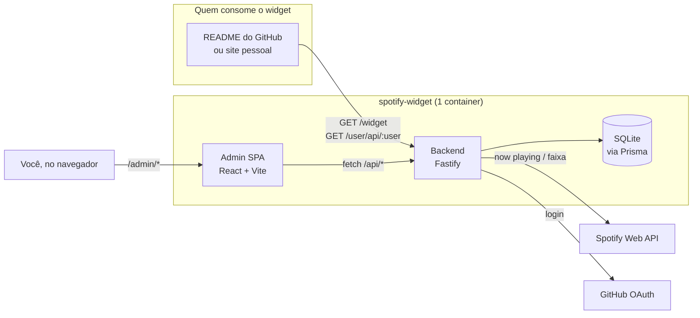

# Spotify Widget

Widget SVG dinâmico mostrando sua música atual ou favorita do Spotify — para README do GitHub, site pessoal ou qualquer lugar que aceite ``. Vem com um painel de administração completo (multi-usuário, RBAC, whitelist de convite) pra quem quiser hospedar pra mais de uma pessoa.

## ✨ Funcionalidades

- 🎵 **Now Playing**: exibe a música que você está ouvindo em tempo real
- 📌 **Track fixa**: fixa uma música específica pra exibir sempre
- 🎨 **Aparência customizável**: tema (dark/light), fundo (padrão/transparente/cor sólida), cor do texto e escala — tudo via query param, sem precisar salvar
- 🔒 **Privacidade**: toggle pra expor/ocultar o JSON público a qualquer momento
- 👥 **Multi-usuário**: RBAC completo (admin / user / viewer)
- 🔐 **Múltiplos providers**: senha, GitHub OAuth ou modo público — pode combinar
- 🐳 **Deploy em 1 comando**: `docker compose up --build -d`, zero config obrigatório

## 🗺️ Como as peças se encaixam



O backend serve as duas coisas: a rota pública `/widget` (o SVG) e o painel `/admin` (a SPA que você usa pra configurar tudo). Cada usuário guarda suas próprias credenciais do Spotify no banco — não existe client ID/secret "global" no `.env`.

## 🚀 Quick Start

A forma mais rápida de rodar é via Docker — veja a seção "🐳 Docker Quickstart" mais abaixo, sobe com 1 comando e sem `.env`.

Pra rodar direto na máquina (sem Docker):

### Requisitos

- Node.js 22+
- pnpm
- Conta Spotify Developer (opcional, só pro modo Now Playing)

### Instalação

```bash
git clone https://github.com/KaduKessler/Spotify-Readme.git
cd Spotify-Readme

pnpm install

# Configure o .env do backend
cp backend/.env.example backend/.env
# edite backend/.env com suas variáveis (veja abaixo)

cd backend && pnpm exec prisma migrate dev && cd ..

# Inicia backend (porta 3000) + admin (porta 5173) juntos
pnpm dev
```

Acesse `http://127.0.0.1:5173` pra usar o painel em dev (proxy pro backend embutido), ou `http://127.0.0.1:3000/widget` pra ver o SVG puro.

### Configuração Básica

Edite `backend/.env` (é aí que o backend lê, não na raiz):

```env
# Autenticação (escolha um ou mais)
ENABLE_PASSWORD_AUTH=true
ENABLE_GITHUB_AUTH=false
ENABLE_NONE_AUTH=false

# Admin inicial (para password auth)
ADMIN_USERNAME=seu_usuario
ADMIN_PASSWORD=senha_forte_aqui

# GitHub OAuth (se ENABLE_GITHUB_AUTH=true)
GITHUB_CLIENT_ID=seu_github_client_id
GITHUB_CLIENT_SECRET=seu_github_client_secret

# URLs (o callback do GitHub OAuth é montado a partir de APP_URL)
APP_URL=http://127.0.0.1:3000
ADMIN_URL=http://127.0.0.1:5173

SESSION_SECRET=gere_com_openssl_rand_hex_32
```

> Credenciais do Spotify (Client ID/Secret) **não vão no `.env`** — cada usuário cadastra as suas próprias na aba Configuração do painel, depois de logar.

## 🔐 Sistema de Autenticação e RBAC

### Providers de Autenticação

O sistema suporta **múltiplos providers simultâneos**:

#### 1. Password Authentication

```env
ENABLE_PASSWORD_AUTH=true
ADMIN_USERNAME=seu_usuario
ADMIN_PASSWORD=sua_senha
```

- Permite múltiplas contas locais com senhas hasheadas (bcrypt)
- Credenciais armazenadas no banco de dados
- Admin inicial configurado via env vars (fallback)

#### 2. GitHub OAuth

```env
ENABLE_GITHUB_AUTH=true
GITHUB_CLIENT_ID=...
GITHUB_CLIENT_SECRET=...
```

O callback (`{APP_URL}/auth/github/callback`) é montado automaticamente a partir de `APP_URL` — não existe uma variável separada pra ele. Registre essa URL no OAuth App do GitHub.

- Autenticação via GitHub OAuth
- Cria conta automaticamente no primeiro login (respeitando política de registro)

#### 3. None Mode (Public)

```env
ENABLE_NONE_AUTH=true
```

- Modo totalmente público, sem autenticação
- Útil para uso pessoal ou demos

### Roles e Permissões

O sistema tem 3 roles:

| Role | Permissões |
| --- | --- |
| `admin` | Acesso total: gestão de usuários, config global |
| `user` | Editar própria config do widget e credenciais |
| `viewer` | Apenas visualizar (sem edição) |

### Políticas de Registro

Controle quem pode criar conta:

```env
REGISTRATION_POLICY=open  # ou: github_whitelist, invite_only, closed
```

#### Opções

- **`open`**: Qualquer pessoa pode criar conta
- **`github_whitelist`**: Apenas usuários GitHub na whitelist
- **`invite_only`**: Apenas via convite de admin (futuro)
- **`closed`**: Nenhum registro novo permitido

#### GitHub Whitelist

**Configuração via `.env` (estática):**

Para `REGISTRATION_POLICY=github_whitelist`:

```env
GITHUB_WHITELIST=user1,user2,user3
```

Apenas esses usernames do GitHub poderão criar conta. Essa lista é importada automaticamente para o banco de dados na primeira execução.

**Gerenciamento dinâmico (via Admin Panel):**

Admins podem gerenciar a whitelist dinamicamente através do painel de administração:

- **Adicionar usuários**: Um por um ou em lote (até 100 por vez)
- **Validar no GitHub**: Opção para verificar se o username existe antes de adicionar
- **Rastrear origem**: Identifica se foi adicionado manualmente ou importado do `.env`
- **Remover usuários**: Soft-delete com auditoria (quem removeu e quando)
- **Buscar**: Campo de pesquisa para localizar usuários rapidamente

**Como funciona:**

1. A whitelist do banco de dados **complementa** (não substitui) a do `.env`
2. Usuários na whitelist `.env` são importados automaticamente na primeira execução
3. Campo "Adicionado por" = NULL significa importação do `.env` ou sistema
4. Remover um usuário não deleta do banco (apenas marca como removido para auditoria)
5. É possível reativar usuários removidos adicionando novamente

### Admin Users

Defina admins via env:

```env
ADMIN_USERS=admin,johndoe,janedoe
```

- Usuários nesta lista sempre recebem role `admin`
- Funciona para autenticação por senha e GitHub
- Útil para promover admins sem acessar o banco
- Admins podem usar o painel para gerenciar a whitelist GitHub

### Permitir Cadastro por Senha

```env
ALLOW_PASSWORD_SIGNUP=true  # Permite criar contas locais
```

Se `false`, apenas o admin inicial do env pode logar (mais restritivo).

## 🎛 Painel Administrativo

Acesse `/admin` após autenticar-se. Três abas:

### Aba "Configuração"

Editor único: o preview do widget e os controles ficam lado a lado, muda algo e vê o resultado na hora.

- **Modo**: Now Playing ou Track fixa
- **Tema**: Dark ou Light
- **Aparência**: fundo (padrão/transparente/cor), cor do texto, tamanho (50%–300%) — reflete no preview sem precisar salvar, e vira parte da URL de embed
- **Privacidade**: toggle pra expor/ocultar o JSON público (modal "Flags")
- **Embed**: copia pronto em Markdown, HTML ou URL direta
- **Integração Spotify**: credenciais pessoais (Client ID/Secret) + conectar/desconectar conta + status "tocando agora" (quando modo é Track fixa, pra referência)

### Aba "Usuários" (admin only)

- Lista usuários, provider, role e data de criação, com busca
- Criar usuário novo (senha + role)
- Editar role de qualquer usuário
- Redefinir senha de usuários locais (`provider=password`)

### Aba "Whitelist GitHub" (admin only)

Só aparece com `REGISTRATION_POLICY=github_whitelist`. Gerencia quem pode criar conta via GitHub OAuth:

- Adicionar 1 usuário (com validação opcional contra a API do GitHub) ou em lote (colar vários, um por linha)
- Buscar, ver quem adicionou e quando, remover (soft-delete com auditoria)

## 🛠 API Endpoints

### Públicos

- `GET /widget?user=username` - SVG do widget (veja query params na seção "🎨 Uso do Widget")
- `GET /user/api/:username` - JSON com a track atual (respeita a flag de privacidade)
- `GET /health` - healthcheck
- `GET /ready` - readiness check

### Autenticação

- `POST /auth/login` - Login com username/password
- `POST /auth/logout` - Logout
- `GET /auth/github` - Inicia OAuth GitHub
- `GET /auth/github/callback` - Callback GitHub OAuth
- `GET /auth/spotify` - Inicia OAuth Spotify (Now Playing)
- `GET /auth/spotify/callback` - Callback Spotify OAuth
- `POST /auth/spotify/disconnect` - Desconecta conta Spotify
- `GET /api/auth-config` - Providers e política de registro

### Autenticados

- `GET /api/me` - Info do usuário logado (inclui role)
- `GET /api/config` - Config do widget do usuário
- `POST /api/config` - Atualiza config do widget
- `GET /api/spotify-config` - Credenciais Spotify do usuário
- `POST /api/spotify-config` - Atualiza credenciais Spotify
- `DELETE /api/spotify-config` - Remove credenciais Spotify
- `GET /api/spotify/status` - Status da conexão Spotify
- `GET /api/spotify/now-playing` - Track atual (requer OAuth)

### Admin Only

- `GET /api/admin/users` - Lista todos os usuários
- `POST /api/admin/users` - Cria novo usuário (password)
- `PUT /api/admin/users/:username/role` - Atualiza role
- `PUT /api/admin/users/:username/password` - Redefine senha

## 🎨 Uso do Widget

### Markdown (GitHub README)

```markdown

```

### HTML

```html

```

O jeito mais fácil de montar essa URL é copiar direto do painel (aba Configuração → Embed) — ele já monta com a aparência que você escolheu.

### Query params disponíveis

| Param | Valores | Efeito |
| --- | --- | --- |
| `user` | username | qual usuário exibir (obrigatório fora do painel) |
| `theme` | `dark` \| `light` | sobrescreve o tema salvo |
| `bg` | hex sem `#`, ou `transparent` | cor de fundo customizada |
| `color` | hex sem `#` | cor do texto customizada |
| `scale` | `0.5` a `3` | escala do widget (1 = tamanho original 495×160) |
| `spin` | `1` \| `true` | anima a capa do álbum girando |
| `rainbow` | `1` \| `true` | equalizer com cores em arco-íris |
| `scan` | `1` \| `true` | mostra o scan code do Spotify (abre a faixa no app) |

```markdown
<!-- tema light -->


<!-- fundo transparente, texto branco, 150% do tamanho -->

```

## 🔒 Privacidade

O toggle **"Expor dados no JSON público"** na aba Flags controla:

- **Ligado**: Endpoint `/user/api/:username` retorna dados da track
- **Desligado**: Endpoint retorna `204 No Content` (oculta tudo)

Útil quando você quer pausar a exibição sem desconfigurar o widget.

## 📦 Estrutura do Projeto

```text
Spotify-Readme/
├── Dockerfile             # Build multi-stage (admin + backend num container)
├── docker-compose.yml     # Deploy em 1 comando
├── docker-entrypoint.sh   # Migrations + geração de secrets na 1ª execução
├── backend/               # Servidor Fastify + Prisma
│   ├── .env               # Variáveis de ambiente (lido daqui, não da raiz)
│   ├── .env.example       # Template de variáveis
│   ├── src/
│   │   ├── routes/        # Endpoints
│   │   ├── lib/           # DB, config, auth helpers
│   │   └── plugins/       # Auth plugin
│   ├── prisma/            # Schema e migrations
│   └── data/               # SQLite (gitignored)
├── admin/                 # Frontend React + Vite
│   ├── .env.local          # Variáveis frontend (VITE_*)
│   └── src/
│       ├── components/     # WidgetEditorCard, UsersPanel, etc
│       └── App.tsx         # Orquestra estado + composição das telas
└── TODO.md                 # Roadmap
```

## 🧪 Desenvolvimento

```bash
# Backend + admin juntos, a partir da raiz
pnpm dev
```

Ou separado:

### Backend

```bash
cd backend

pnpm dev              # hot reload (tsx watch), porta 3000
pnpm build             # compila pra dist/
pnpm exec prisma studio  # GUI do banco
```

### Frontend

```bash
cd admin

pnpm dev     # dev server com proxy pro backend, porta 5173
pnpm build   # build de produção
```

## 🐳 Docker Quickstart

Se encontrar erros de build nativo (`better-sqlite3`) ou preferir isolar tudo em um container, use Docker. Não precisa criar `.env` nem gerar segredo antes — sobe direto:

```bash
docker compose up --build -d
```

Na primeira execução, se `SESSION_SECRET` e `ADMIN_PASSWORD` não forem definidos, o container gera valores aleatórios sozinho, persiste em `./data` (pra sobreviver a restarts) e imprime o usuário/senha de admin gerados no log:

```bash
docker compose logs -f app
```

```text
================================================================
 Nenhum ADMIN_PASSWORD definido. Senha gerada pra você:

   usuário: owner
   senha:   aMrsZxNJL_3i11RY

 Salva em /app/data/.admin_password. Troque depois de logar.
================================================================
```

Acesse `http://localhost:3000/admin/` e entre com essas credenciais.

### Customizar

Para fixar suas próprias credenciais em vez das geradas, crie um `.env` na raiz (mesma pasta do `docker-compose.yml`) — o Compose lê automaticamente:

```env
SESSION_SECRET=gere_com_openssl_rand_hex_32
ADMIN_USERNAME=seu_usuario
ADMIN_PASSWORD=sua_senha_forte_min_8_chars
ENABLE_GITHUB_AUTH=false
APP_URL=http://localhost:3000
ADMIN_URL=http://localhost:3000/admin
```

> `ADMIN_USERNAME=admin` sozinho é rejeitado de propósito (checagem de segurança) — use qualquer outro valor.

### Comandos úteis

```bash
docker compose down          # parar
docker compose down -v       # parar e remover volumes (apaga o banco!)
docker compose build --no-cache  # forçar rebuild ignorando cache
```

### Notas

- O compose mapeia `./data:/app/data` pra persistir o banco SQLite, o `SESSION_SECRET` e o `ADMIN_PASSWORD` gerados.
- O healthcheck verifica `/health` a cada 30s.
- Variáveis com `:-` no compose têm valor padrão (não precisam estar no `.env`).

## 📝 Variáveis de Ambiente Completas

Tudo lido de `backend/.env` (ou injetado direto como env var, no caso do Docker). Não existe `PORT`/`HOST` configurável — o servidor sempre sobe em `0.0.0.0:3000` — nem credencial global de Spotify: cada usuário guarda a sua própria no painel, não no `.env`.

```env
# === Auth Providers (habilite 1 ou mais) ===
ENABLE_PASSWORD_AUTH=true
ENABLE_GITHUB_AUTH=false
ENABLE_NONE_AUTH=false

# === Registration Policy ===
REGISTRATION_POLICY=open  # open | github_whitelist | invite_only | closed
ALLOW_PASSWORD_SIGNUP=true

# === Admin Config ===
ADMIN_USERS=user1,user2       # sempre recebem role admin, além do ADMIN_USERNAME
ADMIN_USERNAME=seu_usuario    # não pode ser literalmente "admin" (bloqueado por segurança)
ADMIN_PASSWORD=senha_forte    # mínimo 8 caracteres, não pode ser "admin"

# === GitHub OAuth (se ENABLE_GITHUB_AUTH=true) ===
GITHUB_CLIENT_ID=seu_github_client_id
GITHUB_CLIENT_SECRET=seu_github_secret
GITHUB_WHITELIST=user1,user2  # para REGISTRATION_POLICY=github_whitelist

# === URLs ===
# O callback do GitHub OAuth é montado como {APP_URL}/auth/github/callback
APP_URL=http://127.0.0.1:3000
ADMIN_URL=http://127.0.0.1:5173

# === Session ===
SESSION_SECRET=chave_aleatoria_segura_aqui  # min. 32 chars em produção; gere com: openssl rand -hex 32

# === Security Headers ===
# Ative Helmet em produção para enviar headers de segurança.
# Se você usa um reverse proxy (Nginx Proxy Manager/Cloudflare) que já envia HSTS,
# desative apenas o HSTS do app pra evitar duplicação.
ENABLE_HELMET=true
HELMET_DISABLE_HSTS=true

# === Database ===
DATABASE_URL=file:./data/db.sqlite
```

## 🤝 Contribuindo

Contribuições são bem-vindas! Abra issues ou PRs.

## 📄 Licença

MIT License - veja [LICENSE](LICENSE) para detalhes.

## 🙏 Créditos

- Inspirado em diversos projetos de widgets Spotify para GitHub
- Construído com Fastify, Prisma, React e Vite
